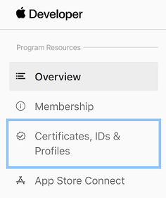
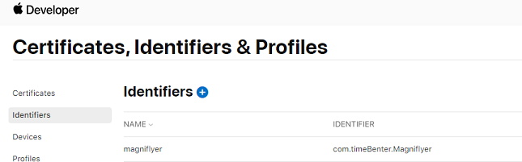
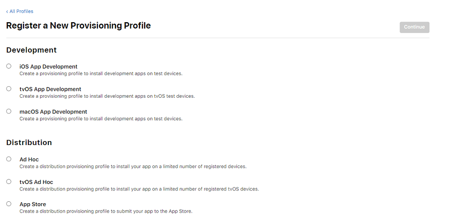
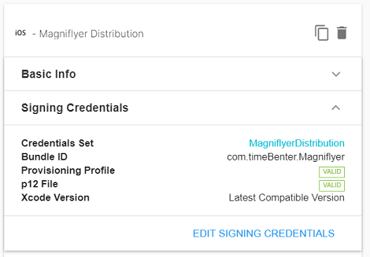
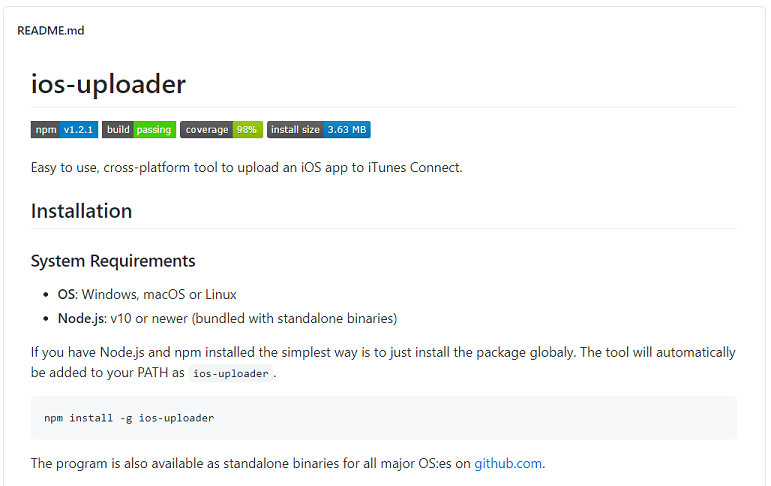
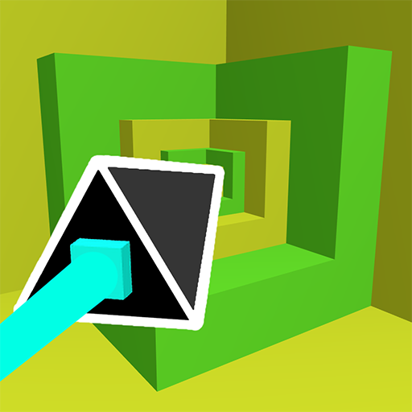

# How to develop a Unity App for iOS on Windows
Date Created: Jan 2021

This is a concise tutorial on how to build and upload Unity made iOS apps to the Appstore on Windows. This tutorial does not require an Apple Mac. 

This tutorial is for Testflight or Production builds.

## Requirements:
- [Apple Developer Account](https://developer.apple.com/programs/enroll/) -> Required to publish iOS apps
- [Unity Cloud Build](https://unity3d.com/unity/features/cloud-build) -> Allows you to build and download .ipa files without Xcode
- [OpenSSL](https://www.openssl.org/source/) -> Used to create the .p12 file REQUIRED to sign your app
- How to use Windows Command Line -> Used for OpenSSL and the ios-uploader tool


# **1. Finsh Your App**
Just a quick self promo here, I finished my app [Magniflyer](https://chrisgamedev.github.io/magniflyer/) and if you feel like you need a break from programming, download my app and have some fun.


# **2. Creating an Apple Provisioning Profile**
You need OpenSSL to do this step. Use this [tutorial](https://medium.com/swlh/installing-openssl-on-windows-10-and-updating-path-80992e26f6a1) to install it.

## **1) Create a key and Certificate Signing Request**
To create the .key file, run the following command:

```
openssl genrsa -out YourApp.key 2048
```

To create the .certSigningRequest file (CSR), run the following command, replacing the filename, email and name details with yours (where AU is your country code):

```
openssl req -new -key YourApp.key -out YourApp.certSigningRequest -subj "/emailAddress=you@yourdomain.com, CN=Your Name, C=AU"
```

I reccomend creating a folder to put the files you just made.


## **2) Create a key and Certificate Signing Request**
Go to the [Apple Developer Console](https://developer.apple.com/account/resources/certificates/list) and create a new certificate. Select the Apple Distribution Certificate. After this step, it will ask for your CSR certificate, so make sure you know where it is saved. Finally, download the .cer file and add it to your folder.



## **3) Create an App ID for your app**
Create an App ID for your app on the [Apple Developer Console](https://developer.apple.com/account/resources/identifiers/list).
I reccomend using reverse domain style format (e.g: com.yourname.yourappname), for Magniflyer, I used "com.timeBenter.Magniflyer", however I recomend not using capitals. You will also need to set this as the bundle id in the Project Settings of your Unity Project.



## **4) Use the .cer certificate to create a Provisioning Profile on the Apple Developer Console**
Choose the Appstore Distribution profile. Then choose the app id, and then choose the certificate you download in step 2). Name it, generate it and then download it, adding it to your folder of files.



## **5) Use the .cer certificate to create a .p12 certificate**
Only two things left todo! Use this command to create a .pem file from the .cer file

```
openssl x509 -in distribution.cer -inform DER -out YourApp.pem -outform PEM
```

Enter this command to create the .p12 certificate, it will require you to enter a password. Make sure you remember what that password is as well.

```
openssl pkcs12 -export -inkey YourApp.key -in YourApp.pem -out YourApp.p12
```

Finally, you have all the necessary files to proceed to the next step. If you want another tutorial on how to do this, [this website](https://nintendoengineer.medium.com/creating-an-apple-provisioning-profile-and-a-p12-certificate-using-openssl-ebd443d3b8bb) includes more images and is where I learnt how to do the steps above.


# **3. Setting up Cloud Build**
To configure your iOS [Cloud Build](https://dashboard.unity3d.com/cloud-build), you need the following items:
- Your provisioning profile (.mobileprovision)
- Your .p12 file
- The password that you used to protect your .p12 file

I am assuming you already have set up the source control for the Cloud Build's. If not, [here](https://learn.unity.com/tutorial/unity-cloud-build) and [here](https://www.youtube.com/watch?v=hg6NRJQwXIg) are links to help you out, or you can just find your own tutorial.

Simply setup a new target in Unity Cloud Build and fill out the info, and then you should be good to start a build.




# **4. Setting up Cloud Build**
Assuming the build was successful and you now have the .ipa file, you will need to upload the build to AppstoreConnect.
To do this you will have to use a custom made tool called: [ios-uploader](https://github.com/simonnilsson/ios-uploader). I found this one the best as if you have Node.js you can use npm to install it and add it to your path, and then it is just one command to upload your build (see the github link for more details).




# **5. Setting up Cloud Build**
Now, after a minute or two, your build should be showing in AppstoreConnect, whether it is for testflight or production.
If you found this helpful, share it to other developers.

Also, if you want to check out my trippy game, Magniflyer, the game that helped me discover how to do all this, download it on [iOS](https://apps.apple.com/us/app/magniflyer/id1535318648) or [Android](https://play.google.com/store/apps/details?id=com.timeBenter.Magniflyer).

