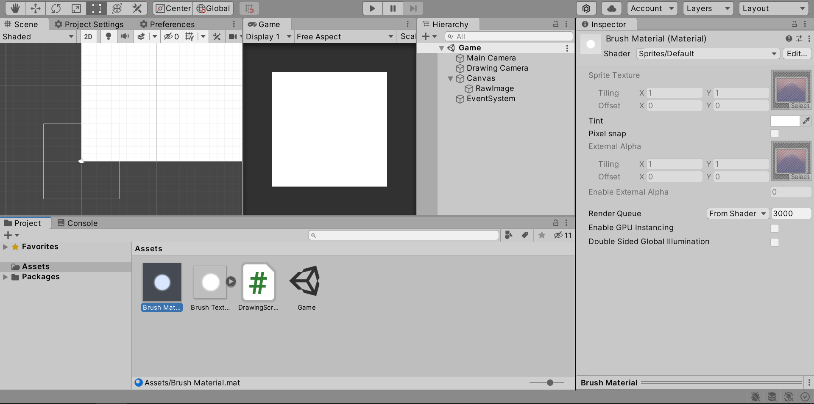
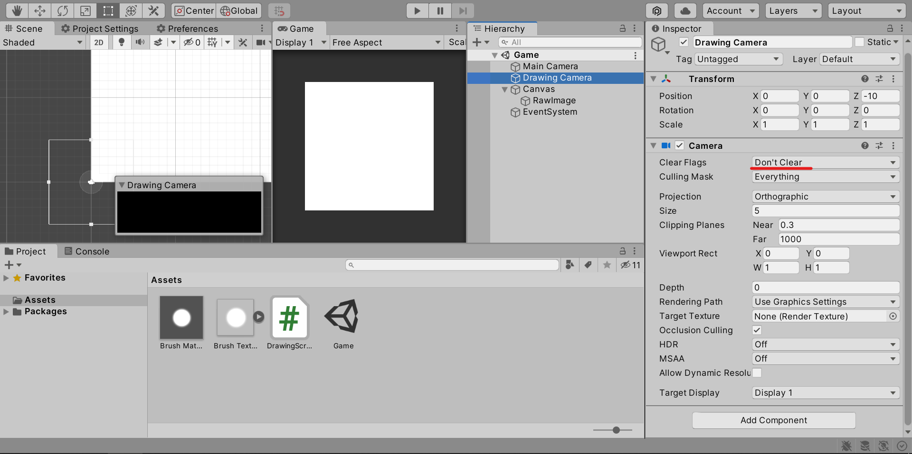
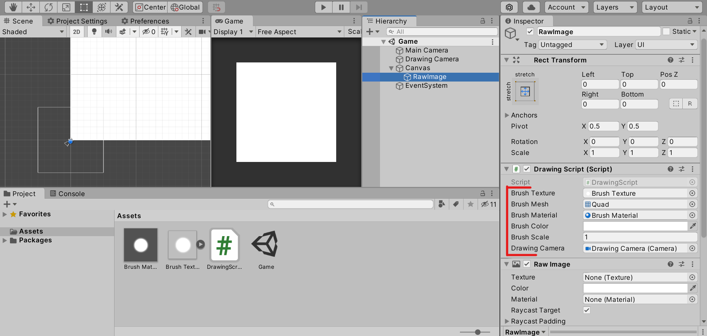

# How to make a drawing/painting game in Unity
Date Created: Nov 2021

This is a tutorial on how to make a performant and flexible drawing mechanic in Unity.

Requirements:
- Basic knowledge about Unity's [render textures](https://docs.unity3d.com/ScriptReference/RenderTexture.html)
- Basic knowledge on vector math.
- Do not worry if you don't full understand everything, the script will work if you set everything up correct.

NOTE: if you don't care about the tutorial, skip to the bottom and download the Unity Package as it will have it all setup for you.


# 1. Drawing Code + Setup

```c
    public Texture2D brushTexture;
    public Mesh brushMesh;
    public Material brushMaterial;
    public Color brushColor = new Color(1, 1, 1, 1);
    public float brushScale = 1f;

    RawImage rawImage;
    RenderTexture renderTexture;

    public Camera drawingCamera;
    void Start()
    {
        rawImage = GetComponent<RawImage>();

        brushTexture.wrapMode = TextureWrapMode.Clamp;
        brushMaterial.mainTexture = brushTexture;

        int width = (int)rawImage.rectTransform.rect.width;
        int height = (int)rawImage.rectTransform.rect.height;

        renderTexture = new RenderTexture(width, height, 1, RenderTextureFormat.ARGB32, 0);
        rawImage.texture = renderTexture;

        drawingCamera.targetTexture = renderTexture;
    }

    void DrawBrush(Vector2 position)
    {
        Matrix4x4 matrix = new Matrix4x4();
        matrix.SetTRS(position, Quaternion.identity, Vector3.one * brushScale);
        Graphics.DrawMesh(brushMesh, matrix, brushMaterial, 0, drawingCamera);
    }            
```
            
This code setups up a render texture so that a brush texture can be drawn onto the screen using the DrawBrush function.
Now all we have to do is draw the brush at the mouse position.
      
## Setup
And use sprites default for the brush material.



Set clear flags on the drawing camera to "Don't clear".



Make sure to assign the correct references in the drawing script. You can use any brush texture. Make sure the brush mesh is a quad.



I will have a Unity Package at the bottom of the tutorial with it all correctly setup for anyone who is lazy.


# 2. Basic Mouse Drawing (Bad)

```c
    void Update()
    {
        Draw();
    }

    private void Draw()
    {
        if (!Input.GetMouseButton(0))
            return;

        Vector2 mousePosition = Camera.main.ScreenToWorldPoint(Input.mousePosition);

        brushMaterial.color = brushColor;
        DrawBrush(mousePosition);
    }
```

Even though this works, if the mouse moves too fast, there will be gaps in the drawing.


# 3. Better Mouse Drawing (Good)
This method interpolates between the previous and current mouse positions and draws points in between, making the drawing look seamless.

```c
    void Update()
    {
        Draw();
    }

    Vector2 lastMousePosition;
    private void Draw()
    {
        if (!Input.GetMouseButton(0))
            return;

        Vector2 mousePosition = Camera.main.ScreenToWorldPoint(Input.mousePosition);

        if (Input.GetMouseButtonDown(0))
            lastMousePosition = mousePosition;

        brushMaterial.color = brushColor;
        foreach (Vector2 point in GetPointsBetween(mousePosition, lastMousePosition))
            DrawBrush(point);

        lastMousePosition = mousePosition;
    }

    Vector2[] GetPointsBetween(Vector2 a, Vector2 b)
    {
        float spacing = 0.05f;
        Vector2 dir = (b - a).normalized;
        float dist = (b - a).magnitude;
        int num = Mathf.RoundToInt(dist / spacing);

        if (num == 0)
            num = 1;

        Vector2[] points = new Vector2[num];

        for (int i = 0; i < num; i++)
            points[i] = a + dir * i * spacing;

        return points;
    }
```

In this code snippet, we must loop through each point returned by the GetPointsBetween and draw a brush at that point. To do this the last mouse position must be saved. The GetPointsBetween can be changed to increase the amount of points between by reducing the spacing variable.

Now you have everything you need to make a drawing game. Keep reading for more tips.


# 4. Clearing the Canvas
```c
    public void ClearCanvas()
    {
        RenderTexture screen = RenderTexture.active;
        RenderTexture.active = renderTexture;
        GL.Clear(true, true, Color.clear);
        RenderTexture.active = screen;
    }
```
To clear the canvas, just call this function. This function just swaps the active rendertexture, to the one with the drawing data, then clears the main camera and then swaps it back.


# 5. What now?
The drawing method can be improved and added to if you want.
- Use [Graphics.DrawMeshInstanced](https://docs.unity3d.com/ScriptReference/Graphics.DrawMeshInstanced.html) to increase the performance of the game (recommended).
- Add a way to export the drawing. (Use something like [texture.ReadPixels](https://docs.unity3d.com/ScriptReference/Texture2D.ReadPixels.html)


Also, I made a satisfying, symmetrical puzzle game using this mechanic, so I would appreciate if you could check it out.


Download [Path Of Patterns](https://chrisgamedev.github.io/pathofpatterns/) right here! Also if you love it, leave a positive review. Thanks!


# 6. Source Code / Unity Project

[DrawingTutorial.unitypackage](./how-to-make-a-drawing-game-in-unity-images/DrawingTutorial.unitypackage)

Here is a tutorial on [how to import Unity Packages](https://docs.unity3d.com/Manual/AssetPackagesImport.html).

Also, here is the full DrawingScript.

```c
using UnityEngine;
using UnityEngine.UI;

[RequireComponent(typeof(RawImage))]
public class DrawingScript : MonoBehaviour
{
    public Texture2D brushTexture;
    public Mesh brushMesh;
    public Material brushMaterial;
    public Color brushColor = new Color(1, 1, 1, 1);
    public float brushScale = 1f;

    RawImage rawImage;
    RenderTexture renderTexture;

    public Camera drawingCamera;

    void Start()
    {
        rawImage = GetComponent<RawImage>();

        brushTexture.wrapMode = TextureWrapMode.Clamp;
        brushMaterial.mainTexture = brushTexture;

        int width = (int)rawImage.rectTransform.rect.width;
        int height = (int)rawImage.rectTransform.rect.height;

        renderTexture = new RenderTexture(width, height, 1, RenderTextureFormat.ARGB32, 0);
        rawImage.texture = renderTexture;

        drawingCamera.targetTexture = renderTexture;
    }

    void Update()
    {
        Draw();
    }

    Vector2 lastMousePosition;
    private void Draw()
    {
        if (!Input.GetMouseButton(0))
            return;

        Vector2 mousePosition = Camera.main.ScreenToWorldPoint(Input.mousePosition);

        if (Input.GetMouseButtonDown(0))
            lastMousePosition = mousePosition;

        brushMaterial.color = brushColor;
        foreach (Vector2 point in GetPointsBetween(mousePosition, lastMousePosition))
            DrawBrush(point);

        lastMousePosition = mousePosition;
    }

    void DrawBrush(Vector2 position)
    {
        Matrix4x4 matrix = new Matrix4x4();
        matrix.SetTRS(position, Quaternion.identity, Vector3.one * brushScale);
        Graphics.DrawMesh(brushMesh, matrix, brushMaterial, 0, drawingCamera);
    }

    Vector2[] GetPointsBetween(Vector2 a, Vector2 b)
    {
        float spacing = 0.05f;
        Vector2 dir = (b - a).normalized;
        float dist = (b - a).magnitude;
        int num = Mathf.RoundToInt(dist / spacing);

        if (num == 0)
            num = 1;

        Vector2[] points = new Vector2[num];

        for (int i = 0; i < num; i++)
            points[i] = a + dir * i * spacing;

        return points;
    }

    public void ClearCanvas()
    {
        RenderTexture screen = RenderTexture.active;
        RenderTexture.active = renderTexture;
        GL.Clear(true, true, Color.clear);
        RenderTexture.active = screen;
    }
}            
```